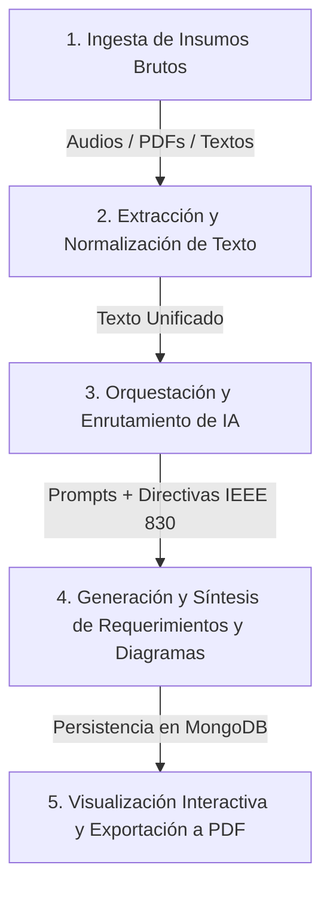

# 🏗️ Arquitectura del Sistema y Flujo de Trabajo de I-CASE

Plataforma inteligente asistida por Inteligencia Artificial para la captura de insumos, especificación formal de requerimientos de software (estándar IEEE 830), síntesis de diagramas de arquitectura UML/C4 y exportación autónoma de informes técnicos en PDF.

---

## 🛠️ 1. Listado de Herramientas y Tecnologías Utilizadas

### 🖥️ **Frontend (Interfaz de Usuario)**
* **React 19:** Biblioteca base para construir una interfaz de usuario reactiva, modular y de alto rendimiento.
* **Vite 8:** Compilador y entorno de desarrollo ultra-rápido para aplicaciones web modernas.
* **TailwindCSS 4:** Framework CSS para el diseño visual, layouts adaptativos y modo oscuro/claro.
* **Lucide React:** Colección de íconos vectoriales modernos y ligeros.
* **Mermaid.js (v12):** Motor para el renderizado interactivo de diagramas en tiempo real en el cliente.
* **jsPDF & html2canvas:** Motor cliente para compilar y descargar el documento técnico formal en formato PDF.

---

### ⚙️ **Backend (Servidor & Lógica de Negocio)**
* **Node.js (v18+):** Entorno de ejecución en JavaScript de lado del servidor.
* **Express.js (v4):** Framework HTTP para definir rutas REST API y middlewares.
* **Clean Architecture (Arquitectura Limpia):** Estructuración en capas independientes de la tecnología:
  * `Core Entities:` Entidades del dominio (`Proyecto`, `Requerimiento`, `Diagrama`).
  * `Use Cases:` Lógica central de negocio ([`ProcesarConIA`](file:///c:/DaS/icase/icase-backend/src/core/use-cases/ProcesarConIA.js)).
  * `Interface Adapters:` Controladores HTTP (`ProyectoController`, `InsumoController`).
  * `Infrastructure Services:` Integración con MongoDB, File System y APIs de IA.
* **Multer:** Middleware para recepción y almacenamiento de archivos subidos en disco local (`.mp3`, `.wav`, `.m4a`, `.pdf`).
* **pdf-parse:** Extractor de texto plano para procesar documentos PDF subidos.
* **Axios:** Cliente HTTP para la comunicación con los proveedores externos de IA.
* **Dotenv:** Gestión de variables de entorno y llaves de acceso.

---

### 🗄️ **Base de Datos & Persistencia**
* **MongoDB:** Base de datos NoSQL documental para almacenamiento flexible.
* **Mongoose ODM (v8):** Modelado de datos orientado a objetos para MongoDB (`Proyecto`, `Requerimiento`, `Diagrama`, `Fuente`, `Estandar`).

---

### 🧠 **Gateway Multi-Proveedor de Inteligencia Artificial (AI Router)**
* **Google Gemini (Gemini 2.0 Flash / Pro):** Procesamiento multimodal de audios, documentos extensos y visión.
* **Groq Cloud (Llama 3.3 70B):** Inferencia de ultra-baja latencia (<2s) para generación de requerimientos y código UML.
* **DeepSeek API (DeepSeek Chat):** Modelo especializado en razonamiento técnico y diseño arquitectónico de software.
* **OpenRouter Fast API:** Gateway alternativo de respaldo (*fallback*) ante contingencias de cuotas o saldos.
* **PlantUMLSynthesizer / Prompt Templates Engine:** Motor de plantillas de prompts (`analista_ieee830.md`, `disenador_arquitectura.md`, `auditor_qa.md`) y sintetizador de código UML.

---

## 🔄 2. Flujo de Trabajo del Sistema (Workflow Paso a Paso)

El flujo operativo se divide en 5 etapas secuenciales:

---

### **Paso 1: Ingesta de Insumos Brutos**
* El usuario abre la plataforma en su navegador (`http://localhost:5173`) y crea un proyecto.
* Sube uno o varios archivos fuente en el panel de insumos:
  * **Audios de reuniones o entrevistas:** `.mp3`, `.wav`, `.m4a`.
  * **Documentos de requerimientos previos:** `.pdf`.
  * **Notas en texto libre:** Descripción del problema escrita directamente.

---

### **Paso 2: Extracción y Normalización en Backend**
* El backend recibe los archivos a través de **Multer**.
* **Archivos PDF:** Se analiza el archivo con `pdf-parse` para extraer el texto legible.
* **Archivos de Audio:** Se procesan para obtener la transcripción fidedigna.
* Toda la información extraída se registra en la colección `Fuentes` de MongoDB asociada al proyecto.

---

### **Paso 3: Análisis y Enrutamiento Inteligente (Caso de Uso: `ProcesarConIA`)**
* El caso de uso [`ProcesarConIA`](file:///c:/DaS/icase/icase-backend/src/core/use-cases/ProcesarConIA.js) recupera el texto consolidado y los estándares vigentes.
* El servicio [`ModelosIaService`](file:///c:/DaS/icase/icase-backend/src/infrastructure/services/ModelosIaService.js) construye el prompt maestro integrando 3 directivas de agentes:
  1. **Analista IEEE 830:** Define Requerimientos Funcionales (RF) y No Funcionales (RNF) con métricas medibles.
  2. **Diseñador de Arquitectura:** Selecciona el stack tecnológico idóneo y define los diagramas UML/C4.
  3. **Auditor QA:** Valida la coherencia y completitud del contenido.
* El enrutador selecciona automáticamente el proveedor activo (**Groq**, **Gemini**, **DeepSeek** u **OpenRouter**).

---

### **Paso 4: Generación y Síntesis de Artefactos**
* La IA devuelve la estructura con:
  * **Nombre y Objetivos del Proyecto:** Título formal, justificación y palabras clave.
  * **Requerimientos Funcionales (RF):** Identificador (`RF-01`), Actores, Precondiciones y Poscondiciones.
  * **Requerimientos No Funcionales (RNF):** Identificador (`RNF-01`), Criterios cuantitativos y Métricas.
  * **4 Diagramas Técnicos (PlantUML / Mermaid):**
    * *Casos de Uso* (Actores y operaciones principales).
    * *Arquitectura C4 (Contenedores)* (Stack dinámico recomendado).
    * *Clases del Dominio* (Entidades, atributos y relaciones).
    * *Árbol de Navegación / WBS* (Jerarquía de módulos y pantallas).
* El componente `PlantUMLSynthesizer` limpia y valida el código generado antes de persistirlo en MongoDB.

---

### **Paso 5: Visualización Interactiva y Exportación a PDF**
* En el frontend React, el usuario explora los resultados:
  * **Pestaña de Requerimientos:** Revisa, edita o aprueba los RF y RNF.
  * **Pestaña de Diagramas:** Visualiza y edita los diagramas con Mermaid/PlantUML.
  * **Exportación a PDF:** Presiona *"Previsualizar documento en PDF"* para descargar el informe técnico impreso listo para entrega formal.
